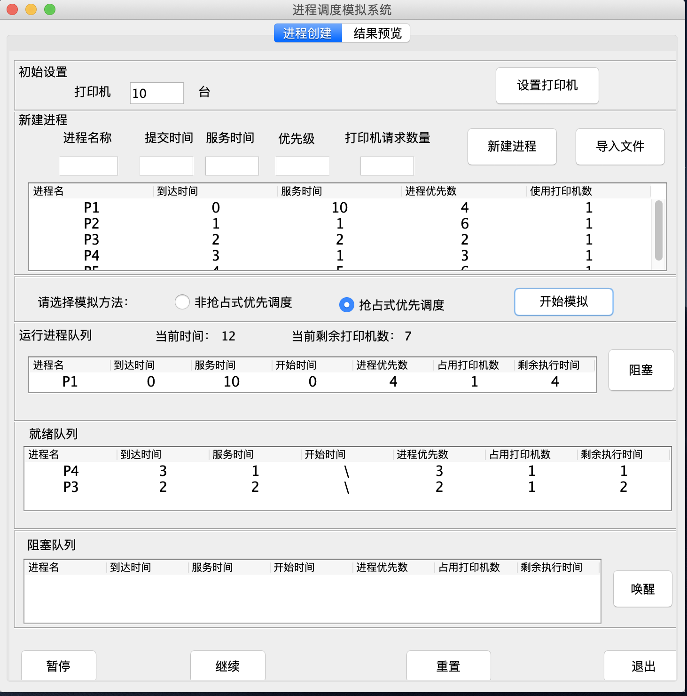
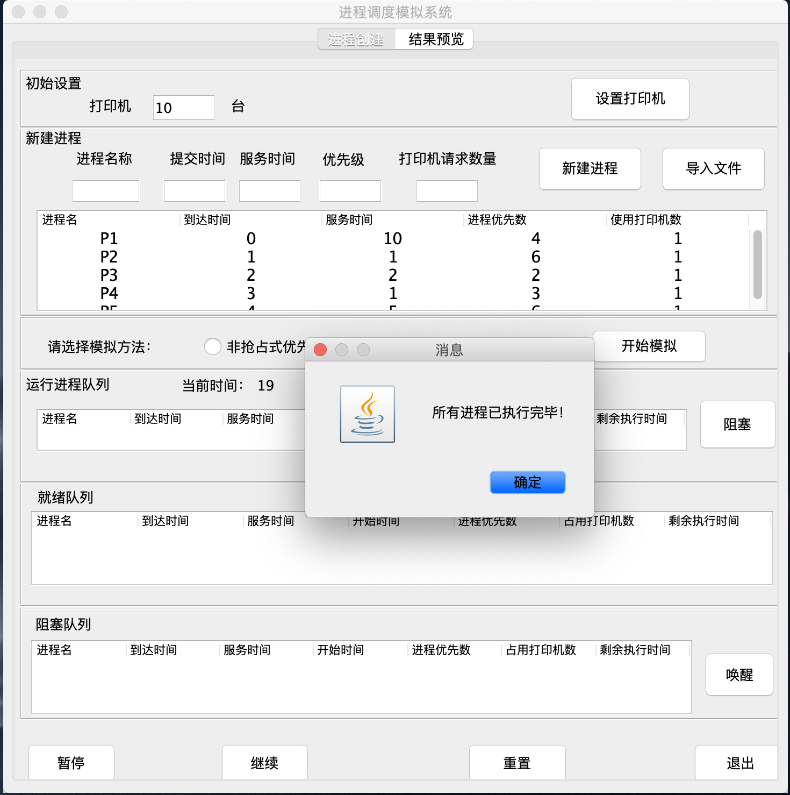
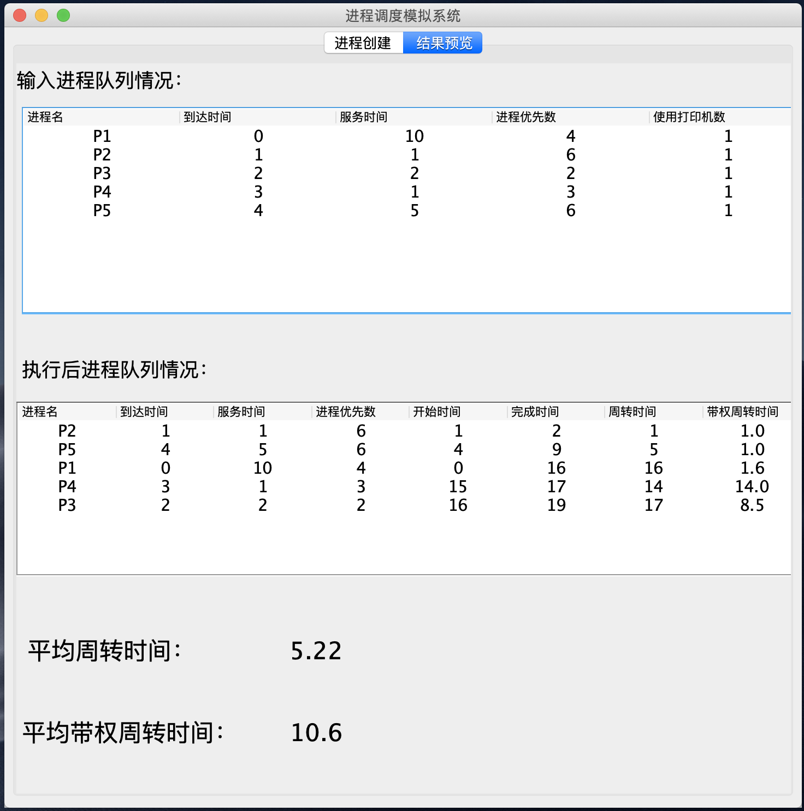

# 基于优先级的非抢占/抢占进程调度算法模拟程序

**作者：vili &nbsp;&nbsp;&nbsp;&nbsp;&nbsp;&nbsp;&nbsp;&nbsp;&nbsp;&nbsp;&nbsp; 联系方式：vili_wzl@126.com**

*该项目仅仅实现基于优先级的两种进程调度算法，其余四种不支持*

[TOC]

## 一、程序功能
1. 新建进程前，请初始化打印机数量，默认为0。
2. 程序可手动创建模拟进程序列，也可从文件导入。创建或导入的进程列表在新建进程列表中显示。
3. 通过文件导入进程信息可以参考testFile目录下的grab.txt文件。
4. 选择模拟的方法:
   1. 非抢占式。
   2. 抢占式。
5. 在模拟运行过程中，可以对当前进程进行阻塞，也可以在阻塞队列中唤醒进程。
6. 在运行过程中可随时暂停模拟，观察结果。验证完毕后可以继续模拟。
7. 模拟结束后可在预览窗口查看模拟运行结果。包括运行时间，周转时间，带权周转时间等信息。
8. 可在主界面重置程序进行下一次模拟，也可随时退出程序。

## 二、项目信息

1. 项目使用IDEA_2017.3.5完成。

2. 在本项目中，笔者为IDEA添加了JFormDesigner插件，制作与修改客户端各个页面时需要用到这个插件。插件的安装及破解请自行百度。（后续会考虑出教程）

3. JDK版本为1.8_211。

## 三、程序截图
1. 主界面：

  

2. 模拟结束：
	
	

3.结果预览：

